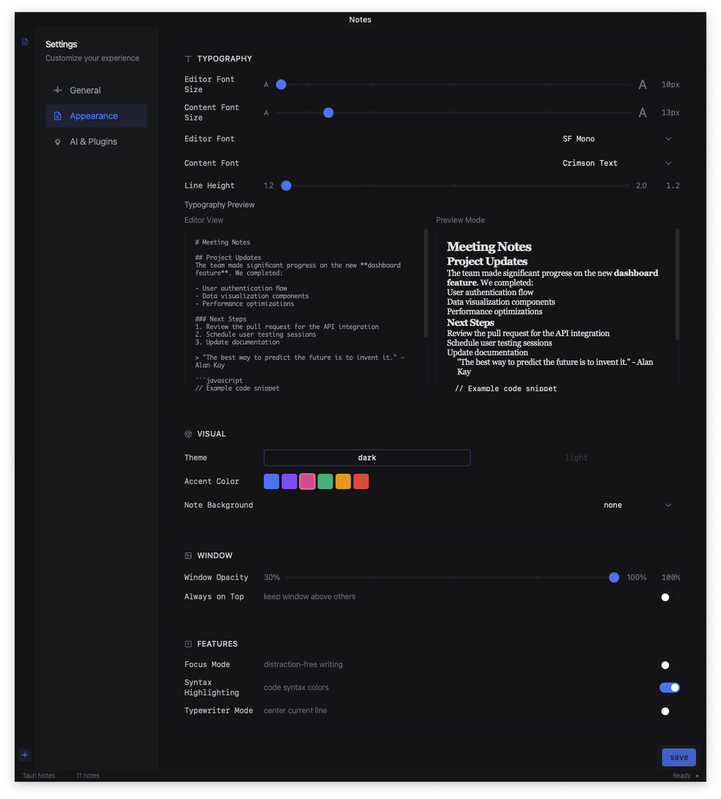

# 🧠 AI-Native Spatial Notes

*From static documents to living, autonomous knowledge agents*


## Vision: The Future of Note-Taking

This isn't just another notes app—it's a paradigm shift toward **AI-native spatial knowledge management**. Instead of treating notes as static documents, we're building an ecosystem where each note becomes an intelligent, autonomous agent that can think, update, and contribute to your understanding without direct prompting.

### 🌟 Core Philosophy

**Beyond AI-Assisted to AI-Inhabited**: Moving from "AI helps with notes" to "notes themselves are intelligent and proactive"

- **Spatial Intelligence** - Position and arrangement convey meaning and workflow context
- **Asynchronous Knowledge Work** - AI works on your behalf while you're not actively using the app
- **Conversational Relationships** - Ongoing dialogues with individual notes, not just queries
- **Emergent Organization** - Structure emerges from AI understanding, not manual categorization
- **Multimodal by Default** - Every note naturally processes text, images, voice, and other inputs

## 🚀 Current Features

### ✨ Multi-Window Spatial Foundation (Phase 1 - **COMPLETED**)

**Detached Note Windows** - Revolutionary spatial note management
- **Drag-to-detach** - Simply drag any note out of the sidebar to create a floating window
- **Spatial positioning** - Arrange notes anywhere on your screen with automatic position saving
- **Smart window management** - Frameless, transparent windows with custom controls
- **Seamless synchronization** - Changes sync instantly between main app and detached windows
- **Visual drag feedback** - Ghost preview and drop zone indicators for intuitive interaction

**Intelligent Interface**
- **Command Palette** (⌘K) - Fast access to all functions with fuzzy search
- **Live Preview** - Markdown rendering with seamless edit/preview switching (⌘⇧P)
- **Auto-save** - Instant saving with visual status indicators
- **Global shortcuts** - Hyperkey+N (⌘⌃⌥⇧N) for global app toggle
- **Focus Mode** - Distraction-free writing that hides all UI elements (⌘.)

### 🎨 Advanced Customization

**Typography & Appearance**
- **Dual font size controls** - Separate settings for editor and preview content
- **Custom fonts** - Choose from system fonts or popular coding fonts
- **Adjustable line height** - Fine-tune text spacing for comfort
- **Background patterns** - Optional paper, canvas, grid, or dot patterns
- **Accent colors** - Six pre-selected colors for UI theming

**Window Settings**
- **Transparency controls** - Adjustable window opacity (30%-100%)
- **Always-on-top** - Keep notes above other applications
- **Typewriter mode** - Center current line while typing
- **Syntax highlighting** - Code blocks with language-specific coloring

### 📝 Core Note Management

- **Markdown-first** with GitHub Flavored Markdown support
- **Smart title extraction** from content (headers or first line)
- **Instant search** through command palette with fuzzy matching
- **Persistent storage** with automatic backups
- **Real-time sync** across all open windows
- **Resizable panels** - Adjust sidebar width to preference

## 🛠 Tech Stack

- **Frontend**: React 18, TypeScript, TailwindCSS v4, Zustand state management
- **Backend**: Rust (Tauri v2) for native performance and security
- **Database**: File-based JSON storage (easily migratable to databases)
- **UI**: Hacker-oriented design with glass morphism and spatial awareness
- **Editor**: Custom textarea with typewriter mode and live preview
- **Build**: Vite for fast development, cross-platform desktop app

## 🏃‍♂️ Quick Start

### Prerequisites
- **Node.js 18+** and **pnpm**
- **Rust** (latest stable)
- **macOS/Windows/Linux** (cross-platform support)

### Development Setup

```bash
# Clone and install dependencies
git clone <repository-url>
cd tauri-notes-app
pnpm install

# Start development server
pnpm run tauri dev

# Build for production
pnpm run tauri build
```

### Usage

1. **⌘K** - Open command palette for quick actions
2. **Create notes** - Click + or use ⌘N / ⌘⇧N
3. **Detach windows** - Drag any note from the sidebar to create a floating window
4. **Arrange spatially** - Position windows anywhere; locations are remembered
5. **⌘⇧P** - Toggle between edit and preview modes
6. **⌘,** - Open settings for customization
7. **⌘.** - Toggle focus mode for distraction-free writing
8. **Hyperkey+N** - Global app visibility toggle (requires accessibility permissions)

## 🗺 Development Roadmap

### ✅ Phase 1: Multi-Window Spatial Foundation
*Status: **COMPLETED***
- ✅ Drag-to-detach note windows with spatial positioning
- ✅ Window state persistence and restoration
- ✅ Command palette with fuzzy search
- ✅ Cross-window content synchronization
- ✅ Advanced typography and appearance settings
- ✅ Focus mode and typewriter mode
- ✅ Resizable panels and customizable UI

### 🔄 Phase 2: AI Integration Foundation
*Status: **NEXT***
- 🔲 AI service integration (Claude/OpenAI APIs)
- 🔲 Per-note AI context and understanding
- 🔲 Multimodal input handling (images, voice, documents)
- 🔲 Asynchronous background processing pipeline

### 📋 Phase 3: Conversational Notes
- 🔲 Chat interface for individual note conversations
- 🔲 Per-note conversation history and memory
- 🔲 Cross-note awareness and referencing
- 🔲 Spatial context integration with AI reasoning

### 🤖 Phase 4: Autonomous Processing
- 🔲 Self-updating notes based on new information
- 🔲 AI-generated daily briefings and insights
- 🔲 Pattern recognition across note collections
- 🔲 Proactive suggestions and connections

### 🌐 Phase 5: Advanced AI-Native Features
- 🔲 Note-to-note AI conversations
- 🔲 Ecosystem-level intelligence and synthesis
- 🔲 Adaptive AI behavior learning
- 🔲 Collaborative knowledge evolution

## 📸 Screenshots

### Main Interface
*Clean, minimal design with powerful spatial note management*


### Settings Panel
*Hacker-oriented settings with compact, terminal-like design*



## 🎯 Unique Differentiators

### vs. Traditional Note Apps
- **Spatial arrangement** as a first-class feature, not an afterthought
- **AI-native design** from the ground up, not retrofitted
- **Autonomous intelligence** that works asynchronously

### vs. Current AI Tools
- **Persistent conversational relationships** with individual knowledge domains
- **Spatial context awareness** that influences AI reasoning
- **Multi-window workflow** designed for complex knowledge work

### vs. PKM Tools
- **Living, evolving notes** instead of static knowledge graphs
- **Proactive AI assistance** that surfaces insights without prompting
- **Emergent organization** based on understanding, not manual linking

## 🏗 Architecture Highlights

### Spatial-First Design
- Window positions stored as part of note metadata
- Spatial relationships influence AI context and suggestions
- Visual clustering algorithms for related note grouping

### AI-Native Infrastructure
- Each note maintains its own AI context and memory
- Background processing queue for asynchronous operations
- Cross-note communication protocols for agent interactions

### Performance & Security
- Rust backend for native performance and security
- Local-first with optional cloud sync
- Zero-trust architecture with encrypted local storage

## 🆕 Recent Updates

### Version 1.1.0 - Hacker-Oriented UI & Enhanced Customization
- **Redesigned Settings Panel** - Compact, terminal-like interface with mono fonts
- **Improved Font Controls** - Separate editor and content font sizes with live preview
- **Fixed Save Functionality** - Font size changes now persist correctly
- **Enhanced Visual Consistency** - Unified design language across all UI elements
- **Better Drag Experience** - Smoother drag-to-detach with visual feedback
- **Optimized Layout** - Full-width settings with properly positioned save button

### Version 1.0.0 - Initial Release
- Multi-window spatial note management
- Command palette with fuzzy search
- Markdown editor with live preview
- Customizable appearance settings
- Cross-window synchronization

## 🤝 Contributing

This project represents a new paradigm in knowledge management. We're building something that's never existed before—truly intelligent, spatially-aware, autonomous notes.

### Areas for Contribution
- **AI Integration** - LLM providers, reasoning algorithms
- **Spatial Intelligence** - Window management, clustering algorithms  
- **Multimodal Processing** - Image, voice, document understanding
- **Cross-Platform** - Windows/Linux optimization
- **Performance** - Rust optimizations, memory management

### Development Philosophy
- **AI-native thinking** - Every feature considers autonomous intelligence
- **Spatial awareness** - Position and arrangement matter
- **User empowerment** - Tools that amplify human thinking
- **Emergent complexity** - Simple interactions create powerful behaviors

## 📄 License

MIT License - see LICENSE file for details

## 🔮 The Future

We're building toward a world where your notes don't just store your thoughts—they think alongside you, make connections you haven't seen, and evolve your understanding while you sleep. This is the beginning of truly intelligent knowledge work.

*Ready to join the future of thinking?*

---

**Built with** ❤️ **using Tauri, React, and Rust**  
**Powered by** 🧠 **spatial AI and autonomous agents**